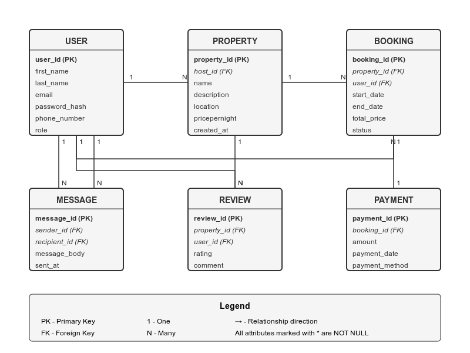

# Requirements for the Entity-Relationship Diagram (ERD)
<h1>ERD</h1>

This diagram represents the database schema for an Airbnb-like application. It includes all the necessary entities and their relationships.

